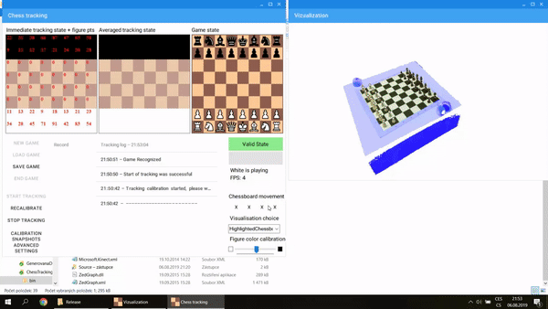

# ChessTracking
C# application using Kinect v2 to track and make recording of the whole chess game in real enviroment.
- able to watch game from various angles
- most materials are in Czech, but may be worth checking - mainly docs/poster.pdf and docs/thesis.pdf

▶️ Screen capture video: https://youtu.be/mPcexamqT0Q \
▶️ Scene setting video: https://youtu.be/isQyzfTcpxA

